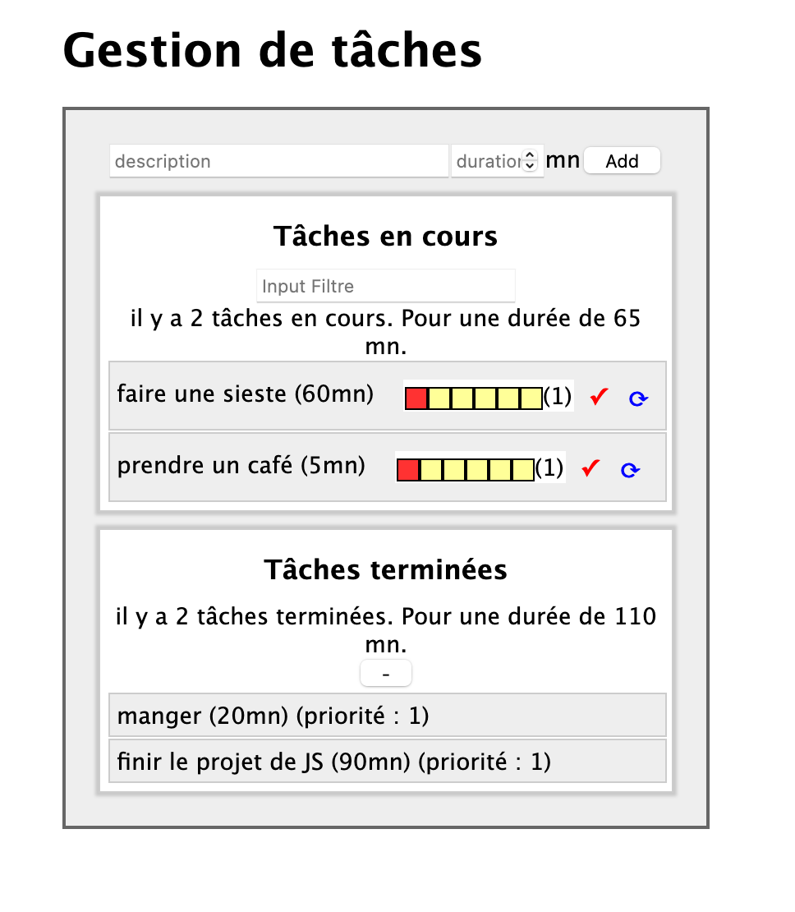

# Projet React

Ce dépôt contient le code du Projet React ([lien vers le sujet](https://www.fil.univ-lille1.fr/~routier/enseignement/licence/js-s4/tdtp/exercice-react-task.html))

## Installation

Pour exécuter le code, tout d'abord vous devez installer les modules en exécutant la commande :

```bash
$ ../rendu-tp-js/fichiers-projet-react-task> npm install
```

## Lancez le jeu

et puis vous devez créer le dossier dist/ et construire un premier bundle en exécutant la commande :

```bash
$ ../rendu-tp-js/fichiers-projet-react-task> npm run build ou npm run watch
```

Vous pouvez ouvrir le fichier dist/index.html, pour vérifier que tout s'est bien déroulé en consultant la console (Ctrl + Shift + K) dans laquelle vous devez lire le message :
  - le bundle a été généré  
  - simulate fetching data from http:/source.of.data/taskData


Pour construire le bundle et visualiser les résultats en démarrant le serveur de développement :

```bash
$ ../rendu-tp-js/fichiers-projet-react-task> npm run dev-server
```

Et finalement, n'oubliez pas d'exécuter la commande **_npm run build_** après l'arrêt du serveur de développement pour mettre à jour le dossier dist/.

## Détail du Projet

Toutes les fonctions de ce projet sont bien mises en œuvre.
il y a une méthode facultative pour éditer (avec la flèche bleue), elle peut éditer la description et la durée de la tâche. Vous pouvez cliquer et changer les valeurs.

**
